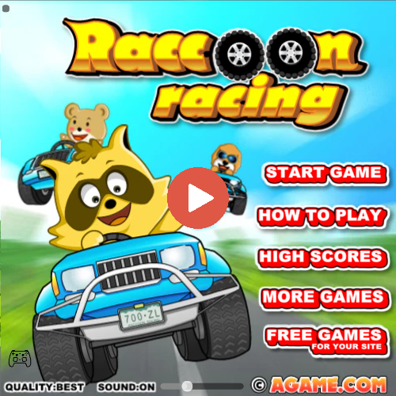
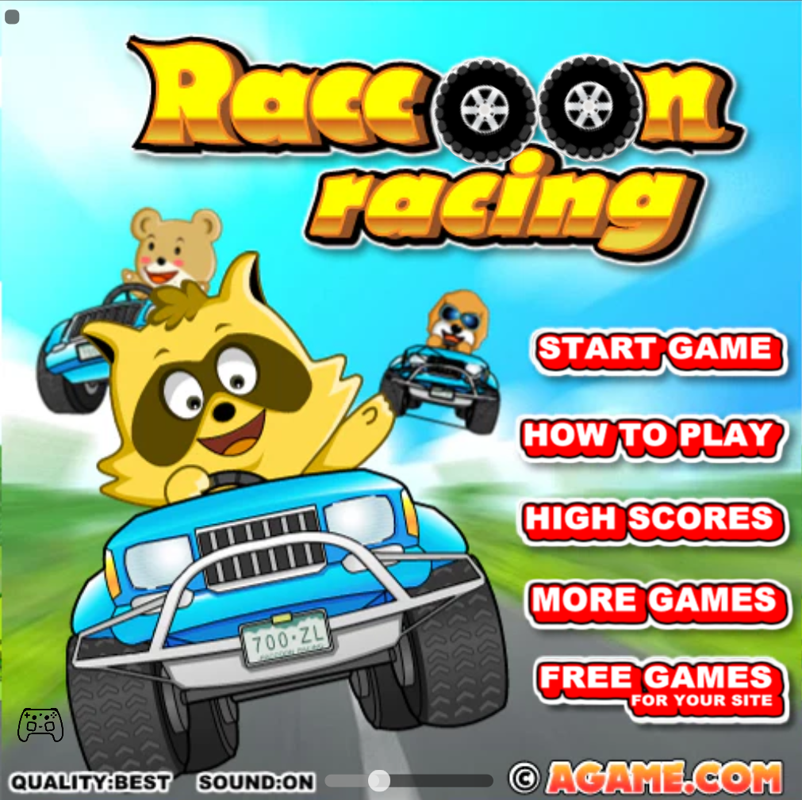
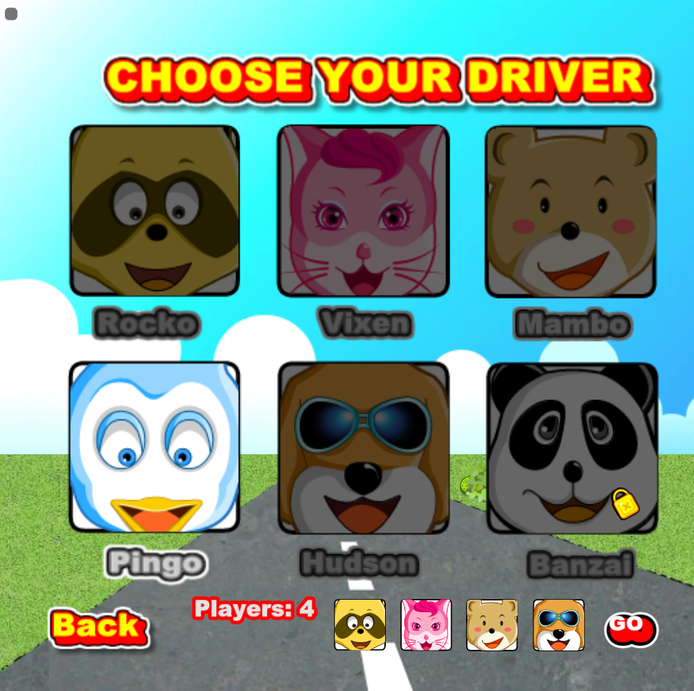
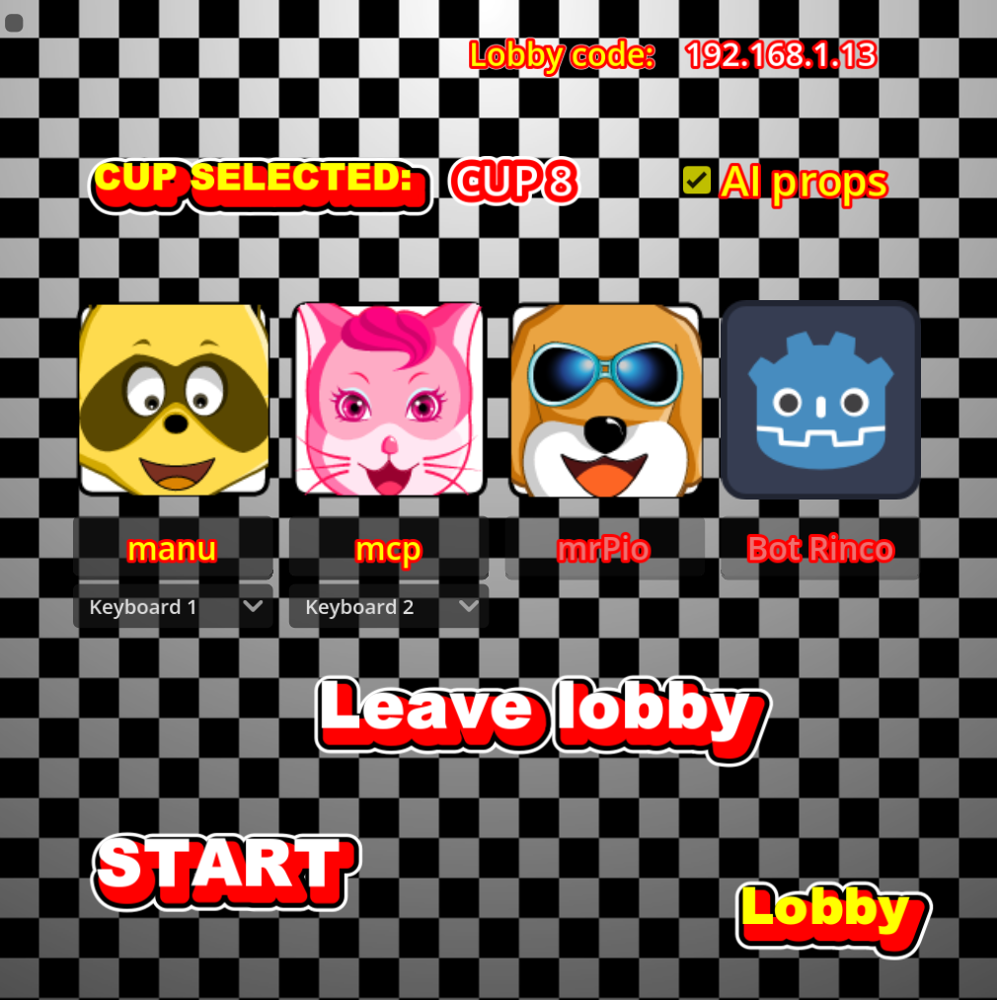
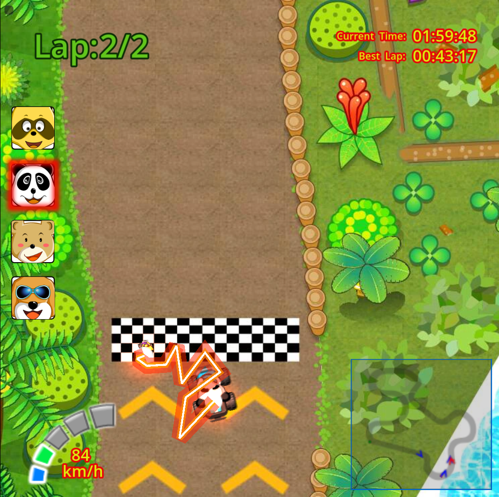
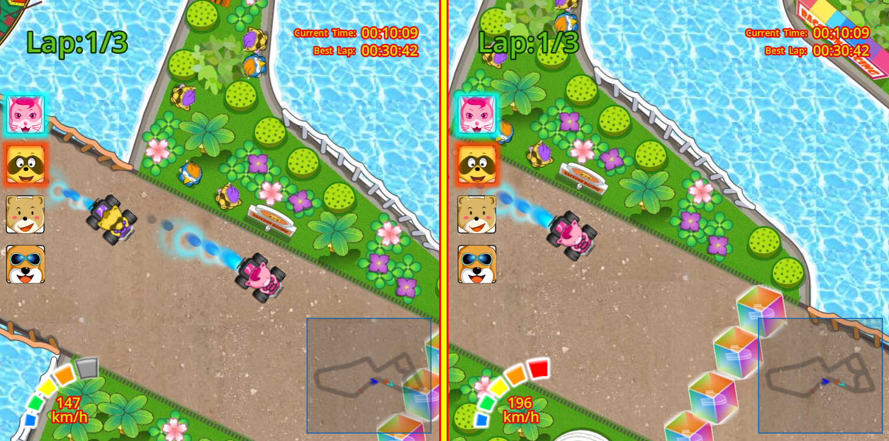
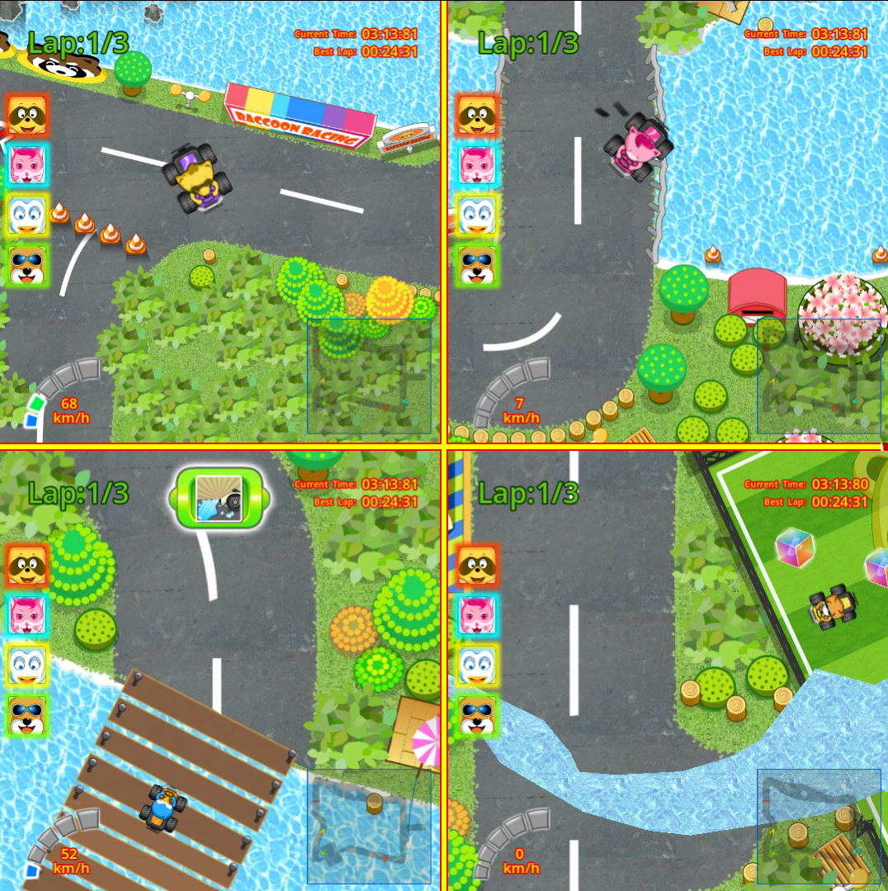
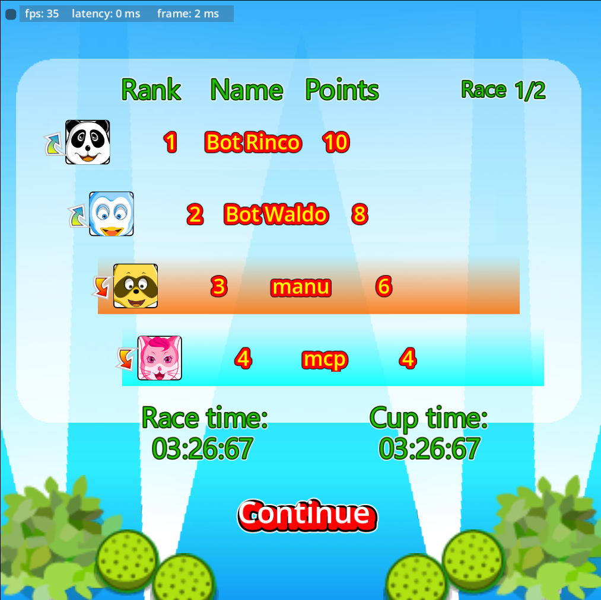
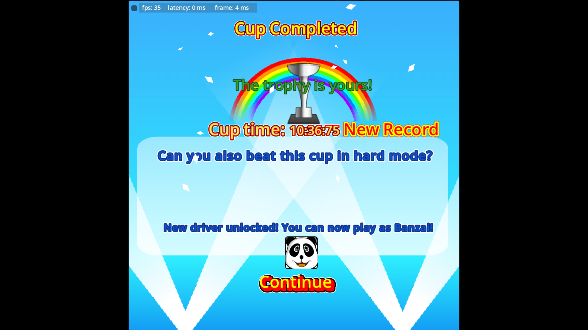

<div align="center">

<h1>RaccoonRacing</h1>


 <p align="center">  </p> <p align="center">     </p>

A full reimplementation of the nostalgic Flash racing game, rebuilt from scratch in Godot 4, with online/LAN multiplayer, 4-player split-screen, controller and mobile support, and (in progress) two competing reinforcement-learning agents.

Free. Open source. Not affiliated with the original.  
All original trademarks, characters, and copyrighted material related to the original Raccoon Racing belong to their respective owners.  
Download it 👉[**here**](https://manuu1311.itch.io/raccoon-racing)👈  
Play the original 👉[**here**](https://www.flashgames.it/raccoon.racing.html)👈
</div>


<h2 align="center">Gameplay</h2>

<p align="center">
  <a href="https://youtu.be/OytxyRGSf5E">
  	
  </a>
</p>

<p align="center">
  <a href="https://youtu.be/OytxyRGSf5E">
  	
  </a>
</p>

<details>
  <summary><b>Click to expand screenshots (8)</b></summary>
  <br>
<table align="center">
  <tr>
    <td align="center" valign="middle">
      <br>
      <sub><b>Main Title</b></sub>
    </td>
    <td align="center" valign="middle">
      <br>
      <sub><b>Character Selection</b></sub>
    </td>
  </tr>
  <tr>
    <td align="center" valign="middle">
      <br>
      <sub><b>Lobby</b></sub>
    </td>
    <td align="center" valign="middle">
      <br>
      <sub><b>Gameplay (Beam)</b></sub>
    </td>
  </tr>
  <tr>
    <td align="center" valign="middle">
      <br>
      <sub><b>Gameplay 1</b></sub>
    </td>
    <td align="center" valign="middle">
      <br>
      <sub><b>Gameplay 2</b></sub>
    </td>
  </tr>
 <tr>
    <td align="center" valign="middle">
      <br>
      <sub><b>Scores Screen</b></sub>
    </td>
    <td align="center" valign="middle">
      <br>
      <sub><b>Win Scene</b></sub>
    </td>
  </tr>
</table>
</details>

## Features
 
**Gameplay**
- Remade animations, custom physics and gameplay logic 
- All 4 original maps, 2 game modes (Car, Hovercraft)
- 6 unlockable characters, 8 cups, 3 difficulty tiers
- AI opponents with improved item usage and race performance over the original

**Multiplayer**
- Online play (host gets a join code, client connects with it)  
- LAN play with IP entry *or* one-click discovery  
- Lobby system with player naming and host-configurable rules (e.g. whether AI racers can use items)
> [!NOTE]
> 💡 **Pro-Tip for Mobile Play:**  
> Want to race on the go without Wi-Fi? Have **Phone A** turn on a Mobile Hotspot and **Phone B** connect to it. Make sure **Phone B** hosts the lobby for the lowest latency and best connection! (If **Phone A** hosts the lobby, packets may not be broadcast correctly, and **Phone B** might need to manually enter the ip to join).

**Split Screen**
- Local split-screen for 2–4 players  
- Per-player input selection in lobby: 2 keyboard layouts ('Keyboard 1': Arrows+Space, 'Keyboard 2': WASD+Z) plus any connected controller
- Split screen also supports LAN multiplayer: play with friends with 2 people on a computer and one joining with a second device!

**Platforms & accessibility**
- Windows, Linux, and Android (touch controls + gyro steering + virtual joystick)
- Gyro settings menu with deadzone slider, neutral-position calibration, and persistent settings
- Full controller support, including UI navigation and rumble on both controller and mobile

**Tooling**
- In-game debug overlay: FPS, frame time, host latency
- Developer console for internal testing


## Controls
 
| Action | Keyboard 1 (Arrows) | Keyboard 2 (WASD) | Controller |
| :---: | :---: | :---: | :---: |
| Steer | ← / → | A / D | Left stick / D-pad |
| Accelerate | ↑ | W | A / R2 |
| Brake/Reverse | ↓ | S | B / L2 |
| Item | Space | Z | X / L1 |

## Roadmap

The game itself is feature-complete, every system below works as intended. What's left is the RL milestone.

| Status | Task |
|---|---|
| ☑️ | Game recreation |
| ☑️ | Online multiplayer support |
| ☑️ | LAN multiplayer support |
| ☑️ | Mobile support |
| ☑️ | Joypad support |
| ⬜ | RL integration |
| ⬜ | RL agent training |  

**Current focus:** building a reinforcement learning environment on top of the finished game to train two specialized agents with different objectives:
 
- **Racing agent** : trained purely to win: optimal lines, item timing, race strategy.
- **Aggressive agent** : trained to disrupt the human player specifically: mine placement and targeted interference, optimized for disruption rather than race performance.
 
## Disclaimer
 
Raccoon Racing is an independent, non-commercial fan remake. All rights to the original game and its concept belong to their respective owners. If you'd like to play the original, you can find it **[here](https://www.flashgames.it/raccoon.racing.html)**.

<!--
## Technical highlights
*The section below is aimed at anyone curious about how it's built.*
 
- **Networking**: online play uses a signaling server purely to exchange connection info (host generates a join code, client uses it), after which the session becomes direct peer-to-peer, the signaling server never touches gameplay traffic. LAN play skips signaling entirely: the host broadcasts on the local network and clients either enter an IP manually or use one-click discovery to catch the broadcast and join automatically.
- **Multiplayer**: each player is authoritative of his own kart, while host is authoritative for one shot events, such as collisions with props and karts. Light client-side prediction is used to keep local collisions responsive.
- **Split-screen architecture**: viewport/camera setup, HUD, and minimap all have a per-player color and input-device assignment is resolved once at lobby setup. The game window is split into up to 4 sub-windows, which only follow a different camera, but with the same source of truth.
- **Custom physics**: the game's physics was built from scratch, to replicate the original, bouncy, flash-like collisions.
-->

## Building from source
 
1. Install [Godot 4.6.2 Stable](https://godotengine.org/download).
2. Clone the repo and open `project.godot` in the Godot editor.
3. Run the project (`F5`), or export via **Project → Export** using the included export presets for Windows/Linux/Android.
**Optional — smaller builds:** the standard editor export includes engine modules the game doesn't use, which inflates the build to ~160MB. A custom-compiled Godot build with those modules stripped brings it down to ~80–120MB depending on platform.

### Custom build
- Download: [Build template](github-data/Build/build_template.gdbuild)
- Compile with:
#### 💻 Windows Build


```cmd
scons platform=windows target=template_release arch=x86_64 ^
  build_profile=path/to/your/build_template.gdbuild ^
  disable_3d=yes ^
  vulkan=no ^
  production=yes ^
  optimize=size ^
  module_mono_enabled=no ^
  module_openxr_enabled=no ^
  module_mobile_vr_enabled=no ^
  use_mingw=yes use_llvm=yes d3d12=no
```
#### 📱 Android Build

```cmd
  scons platform=android target=template_release arch=arm64 ^
    build_profile=path\to\your\build_template.gdbuild ^
    disable_3d=yes ^
    vulkan=no ^
    production=yes ^
    optimize=size ^
    module_mono_enabled=no ^
    module_openxr_enabled=no ^
    module_mobile_vr_enabled=no swappy=yes
```
- See the official [Godot compiling guide](https://docs.godotengine.org/en/stable/contributing/development/compiling/index.html) for platform-specific setup.
This step is optional, the default export from step 3 works fine, it's just larger.

## Contributing & Feedback
Got any questions, ideas, or improvements? Feel free to open an issue or submit a pull request! Contributions are always welcome.

